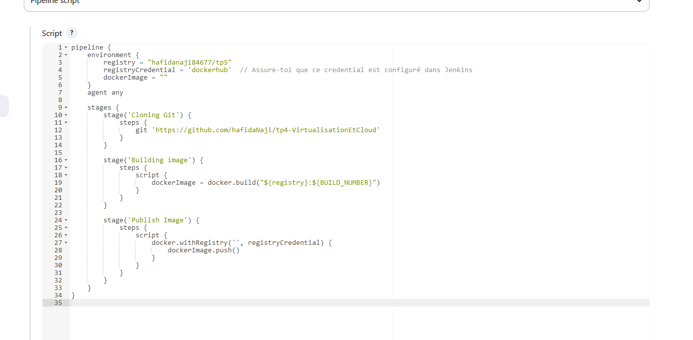

<h1>1. Création du projet</h1>
<h2>Création du projet HTML</h2>

<h2>Création du fichier dockerFile</h2>

<h1>2. Installation de Jenkins</h1>
<h2>Téléchargement de Jenkins et Installation</h2>

<h2>Configuration</h2>
<h3>Aller dans les services de Windows et rechercher le service Jenkins</h3>

<h3>Configuration de Docker TCP dans Jenkins</h3>

<h2>Configuration de Docker Desktop</h2>
<h1>Utiliser le même compte dans Docker Hub</h1>

<h1>3. Installation des Plugins</h1>

<h1>4. Création du job jenkins</h1>

<h2>construire un projet free style</h2>

<h1>5.Configuration du job jenkins</h1>

<h1>6. Test de la configuration</h1>

<h2>Aller jusqu'en bas du fichier pour voir si il n'y a pas d'erreur</h2>

<h1>7. Mise à jour du projet github</h1>
<h2>Un push dans github lancer automatiquement un build dans jenkins</h2>

<h1>8. Supprimer le job dans jenkins</h1>

<h1>9. Partie 2 CI/CD => Intégration continue / Déploiement continue</h1>
<h2>reprendre toutes les étapes précédente et ajouter un script shell</h2>

<h1>10. Créer  job2tp4b2 de type pipeline</h1>
<h>trois
stages (Cloning Git, Building image, Publish Image)</h>

<h2>Configuration</h2>

<h1>10. Créer  job3tp4de type pipeline</h1>
<h2>quatre Stages
(Cloning Git, Building image, Test image, Publish Image)</h2>

